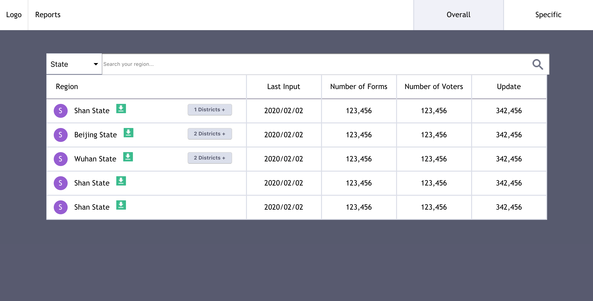

# Frontend Test Wiredcraft



---

### Table of Contents

- [Description](#description)
- [How To Use](#how-to-use)
- [Components](#components)
- [References](#references)
- [Author Info](#author-info)

---

## Description

In this project, the user can view the regions of a country which are divided through the following hierarchy:

```
1. State
2. District
3. Township
```

The user can use the dropdown menu to filter the regions by its preference. The user can also use the search bar to look for a region based on what he/she selected in the dropdown menu. (work in progress for dropdown Menu and search Bar functionality)

#### Technologies

- React
- HTML
- Javascript
- SASS

---

# How To Use

## Installation

#### 1. Install dependencies

`npm install`

#### 2. Run in local server

`npm start`

## Components

- Navbar.jsx
- dropFilter.jsx
- searchBox.jsx
- state.jsx
- district.jsx
- township.jsx

#### Component Description

- **navbar.jsx:** static navigation
- **dropFilter.jsx:** Filter the table by region selected by the user, displays the component based on the state through conditional rendering, for example will render state.jsx component if user selects "State" in the dropFilter. By default, the selection is set to "State" (work in progress)
- **searchBox.jsx:** Filter the region by what the user types in the search bar (work in progress)
- **tableHeader.jsx:** Table header of the table
- **state.jsx:** Displays state level regions
- **district.jsx:** Displays district level regions. This component has properties (props) that are passed to the state.jsx component and is rendered only if the state level region has a district region.
- **township.jsx:** Displays township level regions. This component has properties (props) that are passed to the district.jsx component and is rendered only if the district level region has a township region.

#### Data

The data.js file contains the data for the table. Each json object represents one specific region (state, district, township) in the table row.
State level regions are an `array of objects`, the `subRegions` key includes an array of objects for the child regions.

- subRegions of state are districts
- subRegions of district are townships

The parameters are listed below with their data types:

```
{
id: string,
title: string,
level: string, (State, District, Township)
lastIn: string,
numForms: string,
numVotes: string,
update: string,
subRegions: array[Objects]
}

```

#### Styling

- **\_navbar.scss:** Styling for navbar.jsx
- **\_dropFilter.scss:** Styling for dropFilter.jsx
- **\_searchBox.scss:** Styling for searchBox.jsx
- **\_table.scss:** Styling for entire table

## Scrum Board

As of April 2, here is the status of the project:


## Online Demo

[Video walkthrough](https://www.loom.com/share/7054fba921154d9e92773e0560c8d6a3)

## References

[Table Logic Inspiration](https://gist.github.com/markerikson/bd9f03e0808558c5951e02f1aa98c563)

[Styling of Table and Navbar](https://codepen.io/wxiaojie45/pen/zwMjxE/)

## Author Info

[Yi Zu](http://zuyi.me/)
